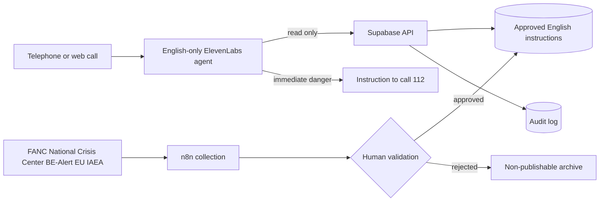

# Target architecture

## Separation of responsibilities

- **ElevenLabs:** English-only dialogue, intent classification, approved tool calls and call termination.
- **Supabase:** versioned source of truth, geographic scope, validity window, one reviewed English instruction and audit trail. Row-level security applies to every exposed table; a `service_role` key is never shipped to a client.
- **n8n:** source collection, change detection, human-review requests, publication or withdrawal, and technical alerts. n8n never publishes safety guidance without human approval.
- **MLab:** conversational observability and evaluation only; it is never an operational instruction source.
- **Authorised human reviewer:** the only actor permitted to move an instruction from `draft` to `approved`.

## Safe states

`draft → in_review → approved → expired/withdrawn`. The voicebot reads only `approved` records inside their validity window and exact geographic scope. On any source, validation or availability failure, it states that verified current official information is unavailable; it never falls back to the last cached instruction.
