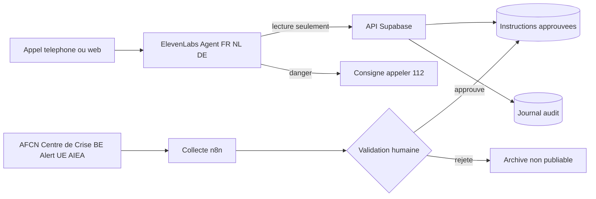

# Architecture cible

## Séparation des responsabilités

- ElevenLabs : dialogue, sélection de langue, voix native, appels d'outils et fin d'appel.
- Supabase : source de vérité versionnée, portée géographique, fenêtre de validité, traductions, audit. RLS active sur toute table exposée ; aucune clé `service_role` côté client.
- n8n : collecte des publications, détection de changements, demande de validation humaine, publication/retrait, alertes techniques. n8n ne publie pas automatiquement une consigne de sécurité.
- MLab : observabilité conversationnelle et évaluation, jamais source d'instruction opérationnelle.
- Humain habilité : seul acteur autorisé à faire passer une consigne de `draft` à `approved`.

## États sûrs

`draft → in_review → approved → expired/withdrawn`. Le bot ne lit que `approved`, dans la fenêtre de validité et pour la portée géographique exacte. En cas d'échec : réponse de non-disponibilité, jamais la dernière consigne mise en cache.
